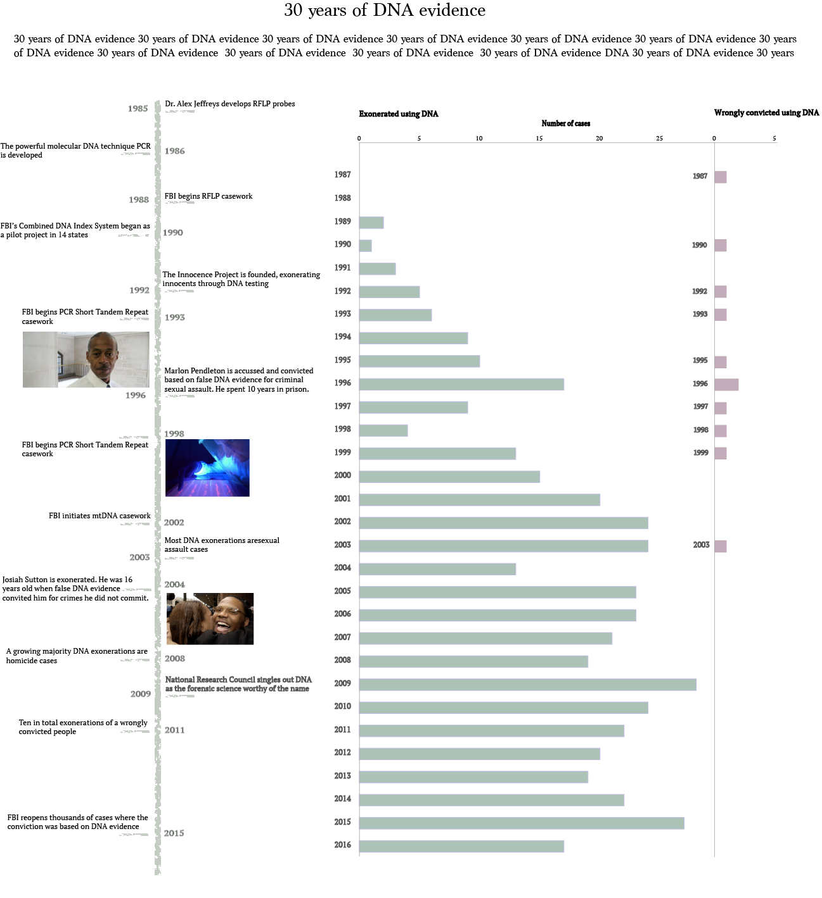

---

title: A Very Cool Project
layout: project

---

# This is my project about something

## 

DNA forensics first made its way into the US courts in 1986 and, up until now, has helped exonerate almost 1/4 of the total innocent individuals (2060 in total) listed in the National Registry of Exonerations database. The accuracy of the technology has made DNA evidence virtually indisputable. A 2009 report from the National Research Council, described DNA as the only forensic science worthy of the name.

Surveys about the operations of forensic crime laboratories (publicly operated) run by the Bureau of Justice Statistics show that 3/4 of the total DNA samples analyzed by these crime labs belong to convicted offenders. Data from the National Registry of Exonerations will help unroll the evolution of DNA forensics in the exoneration of innocent criminal defendants (i.e. year convicted, year exonerated, type of crime, the contributing factor of wrongful conviction).

Yet, recently, geneticists start to question the accuracy of DNA forensics. Thanks to advances, such as the use of PCR (polymerase chain reaction, a simple yet elegant technique invented in 1983 by the maverick scientist Kary Mullis, who was awarded the Nobel Prize in chemistry in 1993), it was possible to detect tiny pieces of DNA, up to a thousand times smaller than DNA analysis of the past. However, PCR's exquisite sensitivity is believed to have backfired. The technique that once was the infallible wise man of forensics probably becomes the most dangerous conviction tool.
Data from the Innocent Project (a non-profit legal organization whose aim is to exonerate wrongly convicted individuals through the use of DNA techniques) show that in a dozen cases the type of forensic science problem linked to the wrongful conviction was the DNA testing itself. I plan to ask this data set the same questions posed before (to National Registry of Exonerations database) and find differences and similarities. Has the champion of forensic science been caught doping?

Modern forensic science is in the midst of a crisis. One had seen enough of prime-time TV would believe that the power of DNA in pointing to the one and only person that committed a crime is indisputable. However, lately, it seems that this has never been the case. The FBI goes back and reopens thousands of cases and redoes the analysis and the math to determine whether indeed the people that were convicted are a real “match”.

Many think of a DNA match as a pregnancy test, where the answer is yes or no. Matching a DNA includes a much more complex procedure and a series of judgments. The DNA samples collected are messy; no criminal lays down a blood drop on a petri dish before leaving the crime scene. The DNA found can be degraded, by light or heat, can be mixed with other DNAs or contaminated during collection. So analysts are confronted with results that need some judgment to determine, first if the data match the subject or secondly how often these similarities are present in a population.

Nevertheless, there is good reason for DNA forensic science to have risen above all other techniques, such as bite-mark analysis, partial fingerprint matching, microscopic-hair-comparison and ballistics testing, which all have been proven far from consistent and trustworthy. There is no doubt that DNA science has helped exonerate hundreds of wrongly convicted individuals, but at the same time felt into some of the sins of its ancestors.