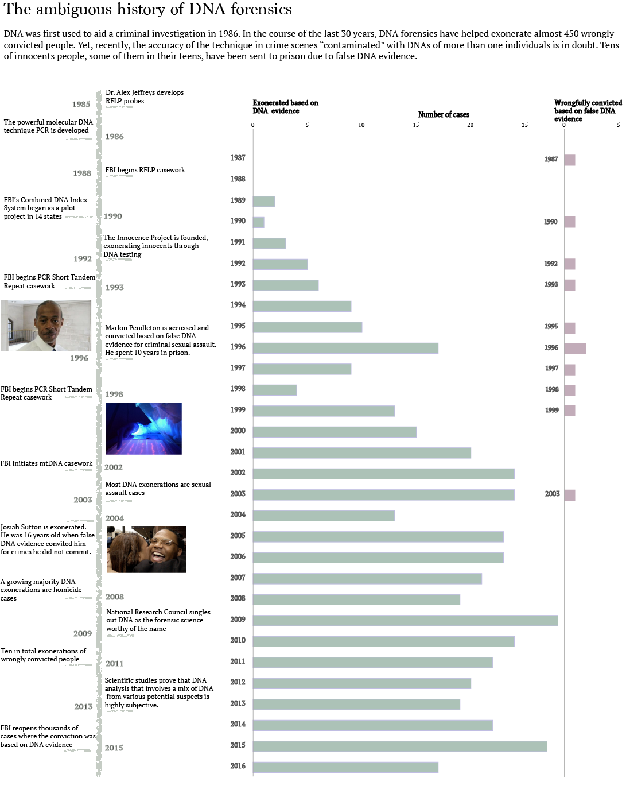

## Project 1

# When DNA is wrong: The champion of forensics science in doubt

DNA forensics first made its way into the US courts in 1986 and, up until now, has helped exonerate almost 450 innocent individuals, according to the National Registry of Exonerations. The accuracy of the technology has made DNA evidence virtually indisputable. Yet, recently, geneticists start to question the accuracy of DNA forensics, not in exoneration cases, but in those of convictions based almost entirely on DNA evidence. 

The journey of DNA forensics begins in 1985 at the University of Leicester in Great Britain, where the geneticist Dr. Alex Jeffreys, develops the technique of genetic fingerprinting. The molecular method of genetic analysis that he used, called Restriction fragment length polymorphisms (RFLPs), involves determining differences in DNA at precise regions, which are unique for every individual. 

Thanks to synchronous advances in genetics, such as the use of the PCR (polymerase chain reaction) technique, it was made possible for forensic scientists to detect tiny pieces of DNA, up to a thousand times smaller than DNA analysis of the past. The simple, yet elegant, PCR technique was invented in 1983 by the maverick scientist Kary Mullis, who, for this discovery, was awarded the Nobel Prize in chemistry in 1993.  

A 2009 report from the National Research Council, described DNA as the only forensic science worthy of the name. There is undoubtedly good reason for DNA forensic science to have risen above all other techniques, such as bite-mark analysis, partial fingerprint matching, microscopic-hair-comparison and ballistics testing, which all have been proven far from consistent and trustworthy. 

The Innocent Project, a non-profit legal organization whose aim is to exonerate wrongly convicted individuals through the use of DNA techniques, has done the math. Almost 200 people have been wrongly convicted because of a forensic science problem with the evidence. Nevertheless, in ten of these cases, the problem was the DNA analysis itself, falling into the same sins of its ancestors. 

---

---

Modern forensic science is in the midst of a crisis. One had seen enough of prime-time TV would believe that the power of DNA in pointing to the one and only person that committed a crime is indisputable. However, lately, it seems that this has never been the case. PCR's exquisite sensitivity in detecting tiny pieces of genetic material is believed to have backfired in its use in DNA forensics. 

Many think of a DNA match as a pregnancy test, where the answer is a yes or a no. Matching a DNA includes a much more complex procedure and a series of judgments. The DNA samples collected are messy; besides no criminal lays down a blood drop on a petri dish before leaving the crime scene. The DNA found at a crime scene can be destroyed in various ways: degraded, by light or heat, mixed with other DNAs or contaminated during collection. Therefore analysts are confronted with results that need some judgment to determine, firstly, if the data match the subject and, secondly, how often these similarities are present in a population.

Additionally, when DNA forensic science was introduced there was the promise of being the rational silver bullet of forensics that will eliminate all the biases of the criminal justice system, such as race and class. On the contrary, the system played out entirely in the DNA context as well. It all starts with the DNA collection policy that mandates that every person arrested or convicted has to provide a DNA sample. It is well known that the US criminal system doesn’t arrest and convict people with total equality. Consequently, when one looks for a DNA match in a pool of samples from people that were caught up in a criminal justice system with all these biases, the inequality trait is inherited to their judgment.

The technique that once was the infallible wise man of forensics has probably become the most dangerous conviction tool. Today the FBI goes back and reopens thousands of cases and redoes the analysis and the math to determine whether the people that were convicted are indeed a real “match”. The champion of forensic science has been caught doping. 
