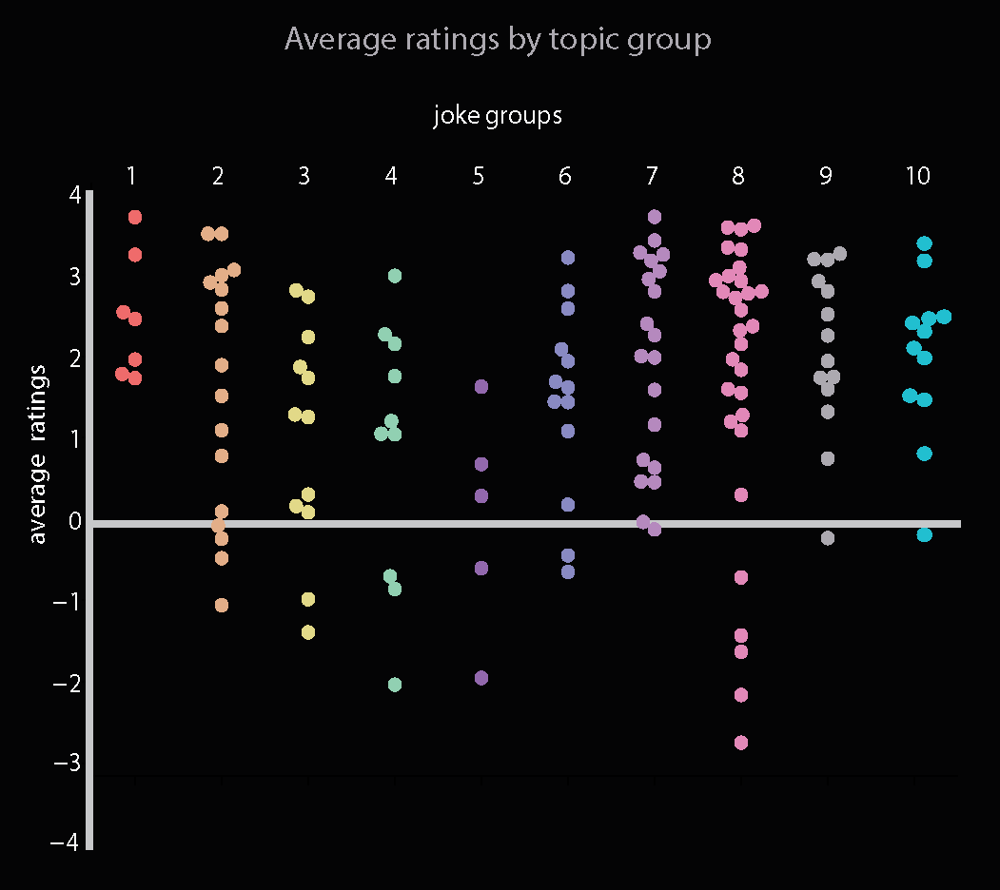

## Project 2

# Testing the theories of humor

Most people rate humor as an important ingredient of life. For example, when asked to point out the most crucial traits of a spouse they usually put the “sense of humor” near the top. Given that humor is such a powerful tool for social success, what are the necessary conditions for something to be funny?

In quest of answers to this question, we looked at a UC Berkeley’s database that contains around 6 million ratings of 150 jokes from more than 100,000 anonymous users. From 1999 to 2009, “Jester”, the website built by Berkeley’s Laboratory for Automation Science and Engineering asks users to rate a list of jokes. In this analysis, we looked at the most complete set of ratings that were collected between 2006 – 2009. 

Scientists have come up with many theories but not with definitive answers about the perfect formula for funny. The three leading theories, as listed in the Stanford Encyclopedia of Philosophy, are the Superiority Theory, the Relief Theory and the Incongruity Theory. 

The Supriority Theory, simply put, supports that “our laughter expresses feelings of superiority over other people or over a former state of ourselves,” mentions John Morreall -a Doctor of Philosophy and Emeritus Professor of Religious Studies at the College of William and Mary in Williamsburg, Virginia – in his Stanford Encyclopedia entry about the philosophy of humor. According to Morreall, the Superiority Theory is based partially on René Descartes’ explanation of laughter in his 1649 book Passions of the Soul where he explains that laughter accompanies three of the six basic emotions: joy, hatred and wonder. However, later, in 1750 the Irish philosopher Francis Hutcheson argued that feelings of superiority are neither necessary nor sufficient for laughter.

Similarly, when I analyzed UC Berkeley jokes using the Word-Emotion Lexicon, “EmoLex”, and we checked for anger, joy and fear we found no association between higher ratings and the existence of these emotions. 

The dominance of the Superiority Theory weakened even further in the 18th century when two new accounts of laughter started to be discussed Relief Theory and the Incongruity Theory. 

As Morreall puts it “The Relief Theory is an hydraulic explanation in which laughter does in the nervous system what a pressure-relief valve does in a steam boiler.” The idea is that laughter releases nervous energy. In 1894 the American philosopher and psychologist John Dewey said that laughter marks the ending of a period of suspense or expectation. It is a “sudden relaxation of strain, so far as occurring through the medium of the breathing and vocal apparatus… The laugh is thus a phenomenon of the same general kind as the sigh of relief.”

As Morreall puts it “The Incongruity Theory says that it is the perception of something incongruous—something that violates our mental patterns and expectations.” This theory, which was adopted by Immanuel Kant and refined by Arthur Schopenhauer, supports that what makes us laugh is the incongruity between what we expect and what actually happens. However, as mentioned in the book, in the beginning in the 1970s, “psychologists began to revise Kant's notion into what is now called the Incongruity-Resolution theory: People laugh at a situation not just because it's incongruous, but because they realize that the incongruity can be resolved or interpreted in a different way.” And this makes sense as many dramatic surprises are not pleasant at all. 

In sequence to this theory, my emotion analysis showed that positivity slightly influences the ratings of jokes by the users, while negativity didn’t play any role in their ratings. The surprise was the emotion that seemed to play some role, with jokes that have an increased level of surprise to be rated better than other. Finally, and surprisingly, the level of anticipation of the jokes was not only unimportant, but seemed to play a negative role in the ratings. 

The two most positive jokes are considered the following:

---

The jokes with the highest level of surprise are considered the following:

---

The joke with the highest level of anticipation is considered:

To explore further the question what makes a popular joke I clustered the jokes in different categories using a machine learning tool that automatically groups similar objects into sets and I present the ratings of the jokes in each group. 

 
As this graph shows, groups 7 and 8 received higher ratings than the rest of groups of jokes. Group 7 was characterized by words such as “father, school, little, boy, teacher, son, mother” – words that indicate that the topic is related to the family. However, the topics of some groups were more difficult to identify than others. Group 8 was characterized by words such as “engineer, hell, parrot”. Similarly, groups 1, 3 and 6 did not include words that point to one specific topic. On the other hand group 2 was related to the topic of death, group 9 was mainly mentioning the words “woman, man” and the topic of group 10 was related to doctors and diseases. Finally, the jokes of group 4 were usually following the format “What’s the difference…?”, while those of group 5 “How many … does it take to …?”.

In the following graph we can see the most popular jokes by topic/group. 

Surprisingly, the majority of these jokes include long texts. Most people believe that a good joke is a short joke. However, this doesn’t seem to be the case. 

