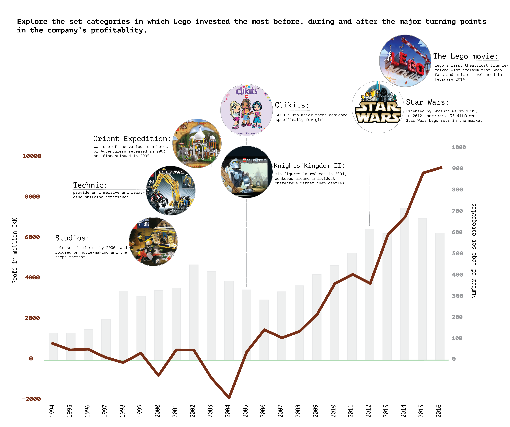
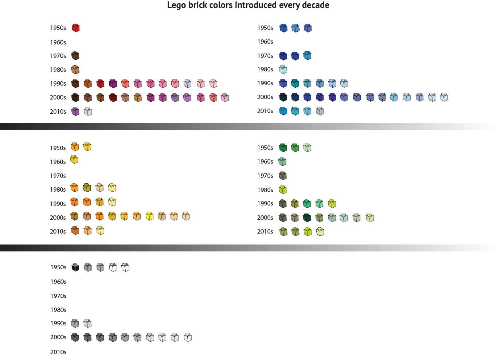

## Project 3

# LEGO: 

Over the course of the last decades, the majority of the sets produced by LEGO were related to construction, exploration and occupations. However, the company’s profit declined significantly between 1994-2004. In 2004 Lego introduced toys that needed minor building skills and were targeted either to girls or boys. In the graph that follows  

---

---

Over the course of the last decades, the majority of the sets produced by LEGO were related to construction, exploration and occupations. However, the company’s profit declined significantly between 1994-2004. In 2004 Lego introduced toys that needed minor building skills and were targeted either to girls or boys. In the graph that follows  

