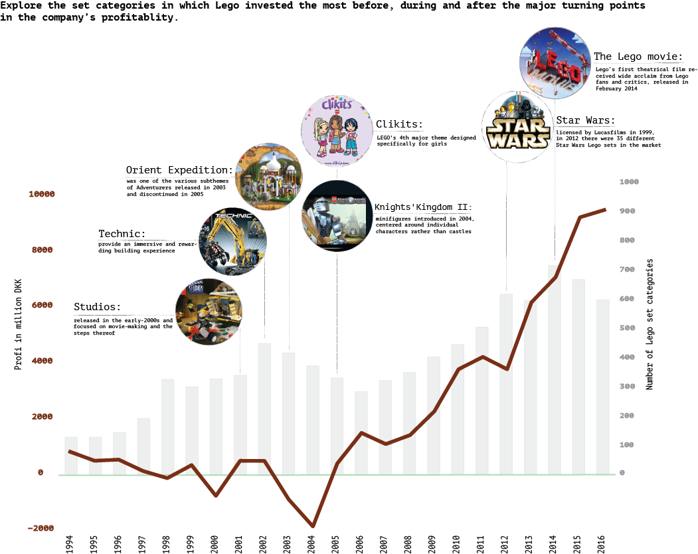

## Project 3

# Lego: 

Over the course of the last decades, the majority of the sets produced by Lego were related to construction, exploration and occupations. However, the company’s profit declined significantly between 1994-2004. In 2004 Lego introduced toys that needed minor building skills and were targeted either to girls or boys. In the graph that follows  

---

---

Modern forensic science is in the midst of a crisis. One had seen enough of prime-time TV would believe that the power of DNA in pointing to the one and only person that committed a crime is indisputable. However, lately, it seems that this has never been the case. PCR's exquisite sensitivity in detecting tiny pieces of genetic material is believed to have backfired in its use in DNA forensics. 

