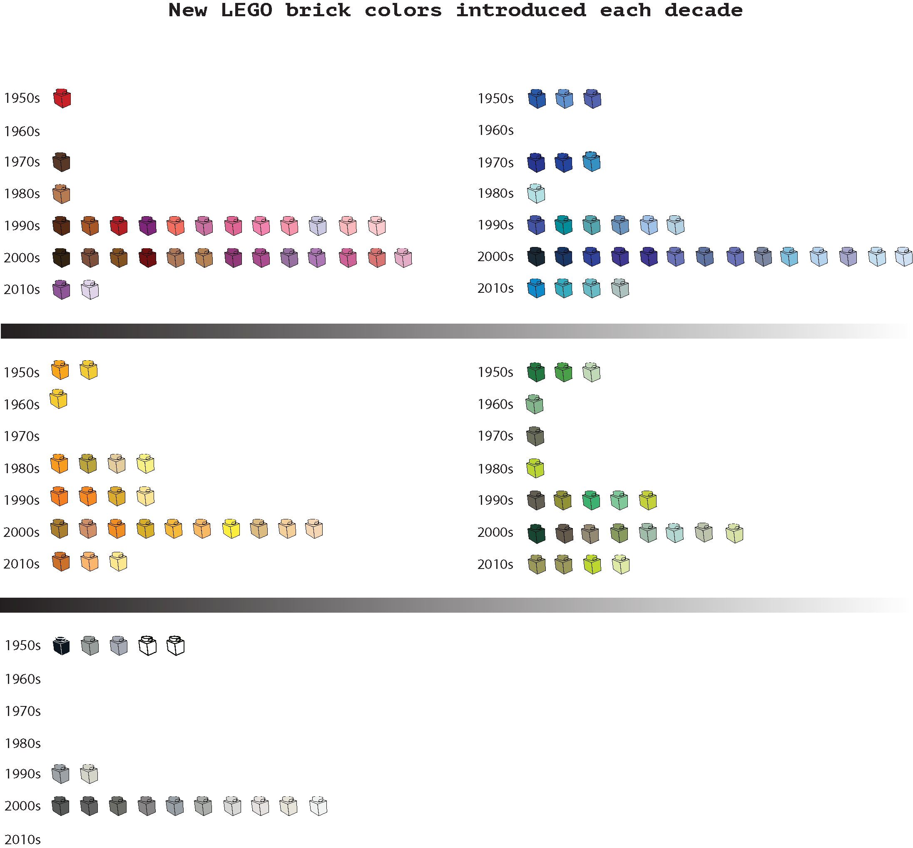

## Project 3

# LEGO: 

## Profits and sets

Over the course of the last decades, the majority of the sets produced by LEGO were related to construction, exploration and occupations. However, the company’s profit declined significantly between 1994-2004. In 2004 Lego introduced toys that needed minor building skills and were targeted either to girls or boys. The graph below presents the profits of the company during the last two decades in relation to the number of different sets introduced, highlighting the set categories of which LEGO released the largest number of set variations. 
 
 

---

---
 

## Colors

In 1950, LEGO used ten colors for its bricks. Today, the LEGO sets include bricks and parts of 69 colors. The record in the number of colors used was in 2005, when LEGO released sets with parts of 90 different colors. 

---

