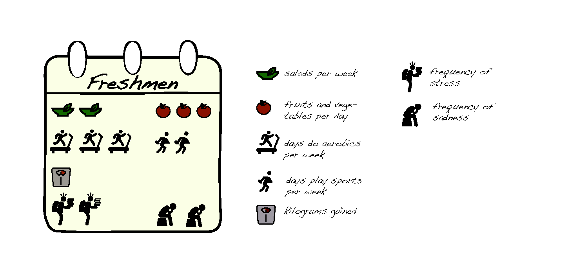
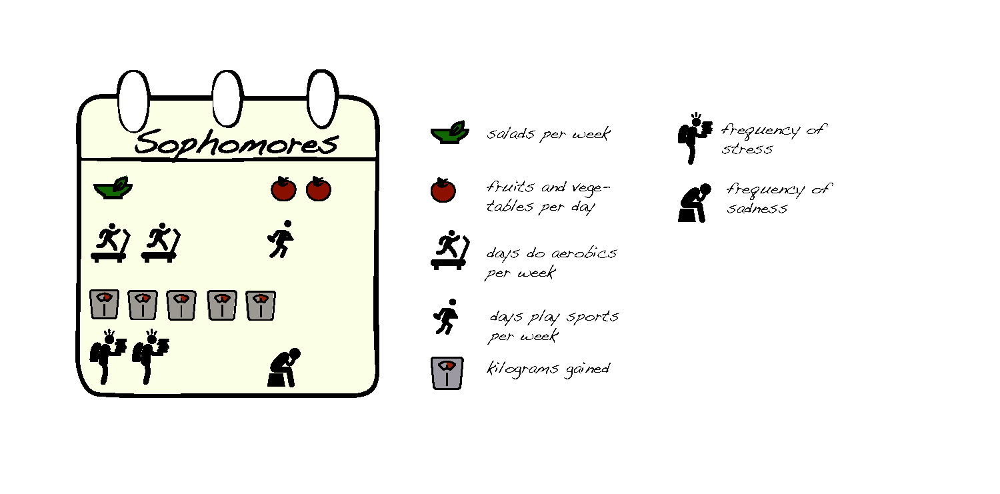

# What seniors should learn from freshmen?

As the beginning of the academic year approaches, what should students prepare for or be cautious about during the upcoming months? In this project I analysed data collected by MIT’s Human Dynamics Laboratory (http://hd.media.mit.edu/) which cover the dynamics of 70 residents of an undergraduate dormitory during the academic year 2008-2009. This dataset contains surveys and sensor data about the diffusion of political opinions, diet, exercise, obesity, eating habits, epidemiological contagion, depression and stress, among the students. 

In this analysis I used data from self-reported surveys to investigate the diet habits, the frequency of exercise and the emotions of students during the four years of their studies. From a quick overview of the results freshmen play the most sports, sophomores gain the most weight, juniors are sad more often and seniors eat the least healthy food.

## In detail

Freshmen reported that they consume on average three portions of fruits and vegetables every day and two salads every week. During the week they play sports twice and they do at least 20 minutes of aerobic exercise three times a week. In the course of the academic year they tend not to gain a lot of weight, just one kilogram on average. During the spring semester they reported being stressed 7 days, and sad 8 days. 

Sophomores reported that they consume on average two portions of fruits and vegetables every day and just on salad per week. During the week they play sports only once and they do at least 20 minutes of aerobic exercise two times a week. In the course of the academic year they tend to gain a lot of weight, about 5 kilogram on average. During the spring semester they reported being stressed 8 days, and sad only 3 days. 

Juniors reported that they consume on average two portions of fruits and vegetables every day and two salads per week. During the week they don’t play any sports and they do at least 20 minutes of aerobic exercise three times a week. In the course of the academic year they tend to gain about 2 kilograms in body weight. During the spring semester they reported being stressed 19 days, and sad 13 days. 

Seniors reported that they consume on average one portion of fruits and vegetables every day and one salad per week. During the week they play sports once and they do at least 20 minutes of aerobic exercise three times a week. In the course of the academic year they tend to gain about 1 kilogram in body weight. During the spring semester they reported being stressed 18 days, and sad 10 days. 

